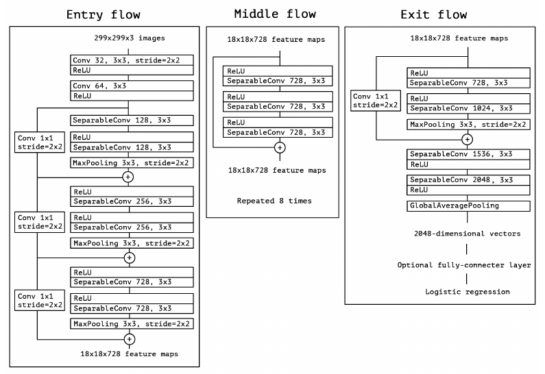
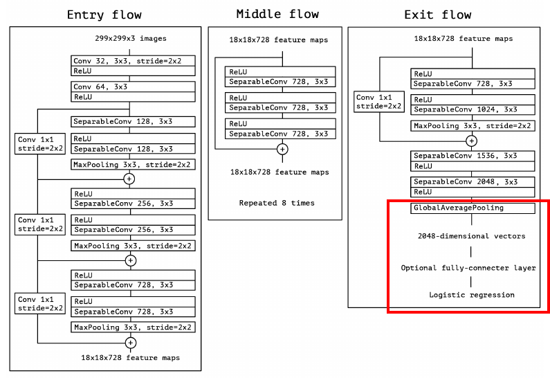
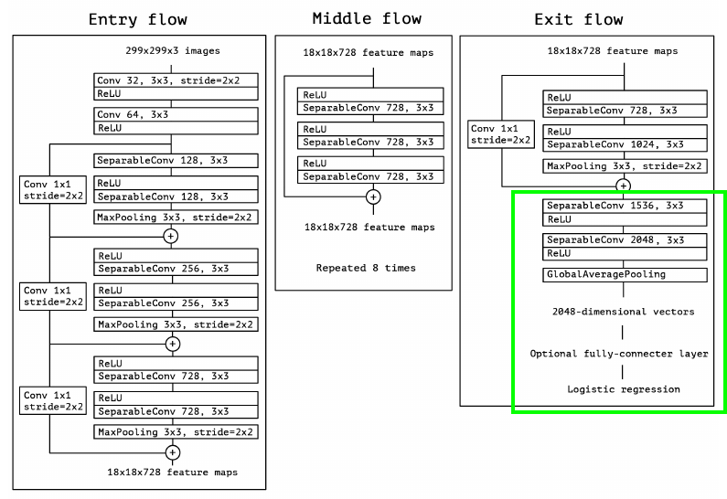
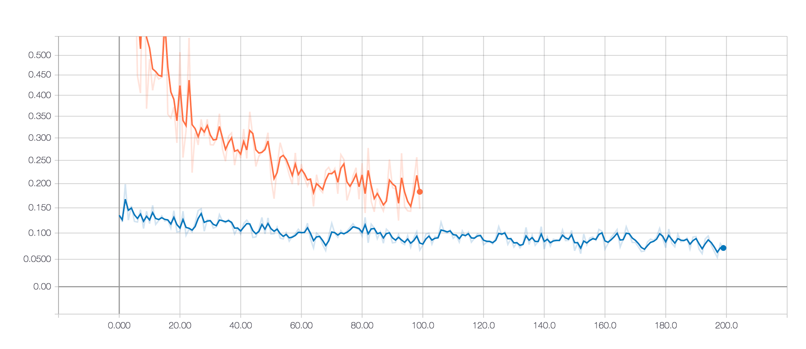
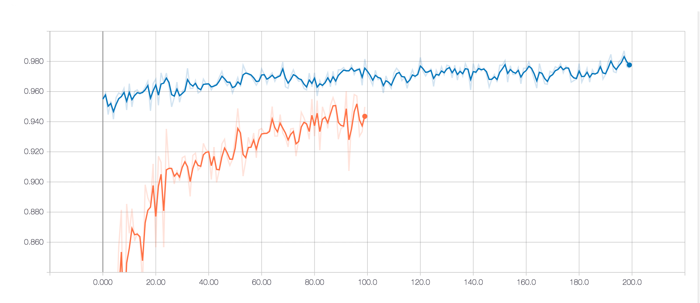
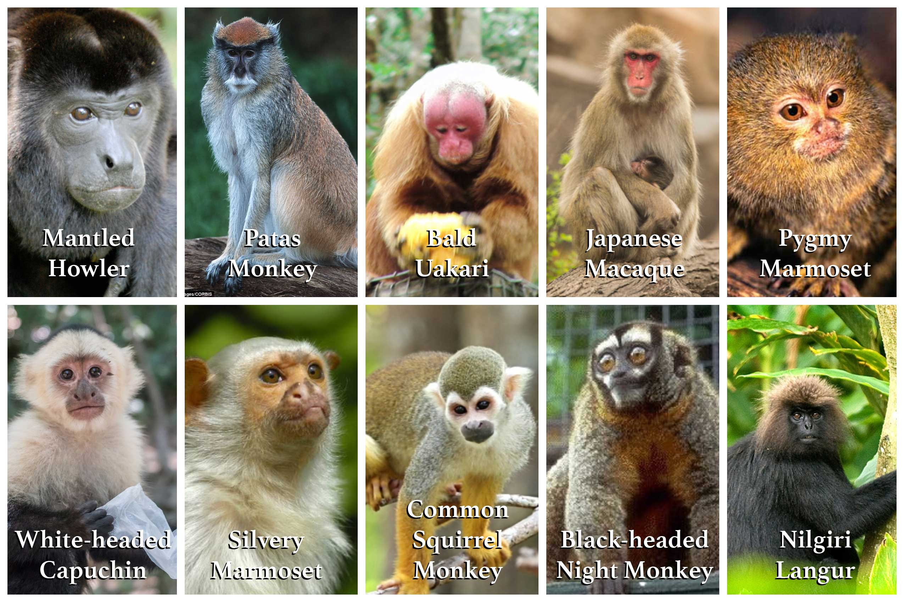

# Monkey Classifier

Previously I trained an image classifier to [classify hot dog](https://github.com/voandy/hotdog-classifier) from not hotdog with 82.45% accuracy. This project is an evolution on that. The hot dog classifier was a binary classifier trained from scratch. This classifier is based on transfer learning and classifies monkeys in to one of 10 species with a staggering 98.70% accuracy.

As we grow-up we learn to recognised objects by analysing and learning from all the things we see. Think of what we see as the training data and our brain as the neural network. When we travel to a new country and are exposed to fantastical new sights we do not have to learn to see again from scratch but rather build on what we already know and re-train our brain to recognise these new sights. This is analogous to transfer learning.

Rather than designing and training models from scratch whenever we are faced with a new problem we can leverage the power of other successful and more generalised image classifiers and re-purpose them to unique purposes.

## Dataset

This dataset was obtained from kaggle.com.

Curator: Mario

https://www.kaggle.com/slothkong/10-monkey-species/home

## Xception Model

The [Xception model](https://arxiv.org/abs/1610.02357) was conceived and designed by Francois Chollet (the same person who created Keras) as an evolution of the already successful Inception V3 model. Our monkey classifier is built on top of Xception.

### Transfer Learning

After we imported the Xception model we removed the top output layers as these layers contain weights specific to classifying images in the ImageNet dataset. 

*The bottom layers of a convolutional neural network are optimised to find low level features such as edges and shapes. As we move up the network the layers become more specialised perhaps detecting high level features like eyes or fur. Finally the output layers specify classes.*

We then replaced this layer with our own untrained densely connected layer and an output layer.

After this we froze the layer weights in the base Xception model and trained the new output layers over 100 epochs. This yielded an accuracy of 96.02% on the testing data, a massive improvement on the hot dog classifier we trained from scratch.

### Fine Tuning

To even further improve this result we tweak the model by unfreezing the next two highest blocks in the Xception model and re-training them. This time we specified a much slower learning rate and a different optimisation algorithm (SGD) so we don't overwrite potentially useful weightings. We keep the bottom layers frozen as the low level features they detect are still very relevant to our problem.

Fine-tuning the model over 200 epochs yielded an accuracy of 98.70% on the testing data. A phenomenal result!

### Loss Graph

Orange: Transfer Learning Phase 
Blue: Fine-Tuning Phase

X: Epochs 
Y: Loss (Categorical Crossentropy)

### Accuracy Graph

Orange: Transfer Learning Phase 
Blue: Fine-Tuning Phase

X: Epochs 
Y: Accuracy

## Predictions

